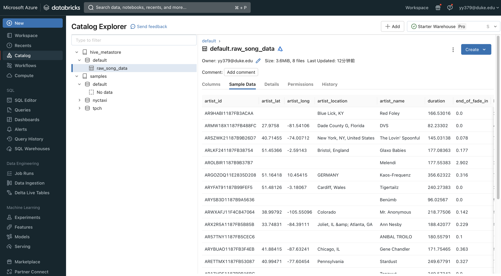
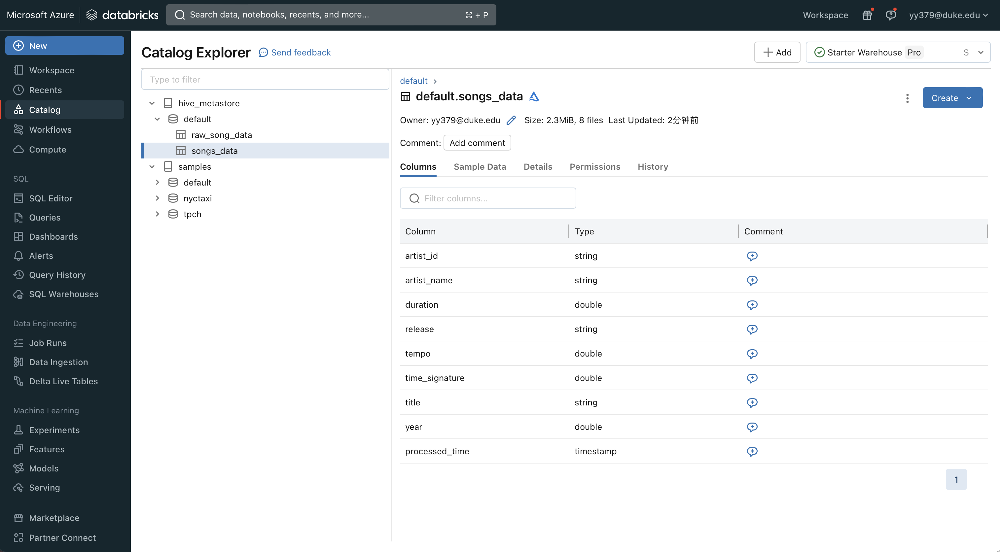
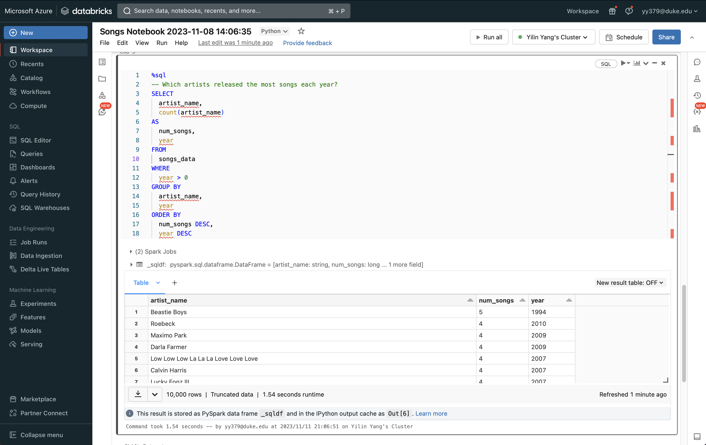
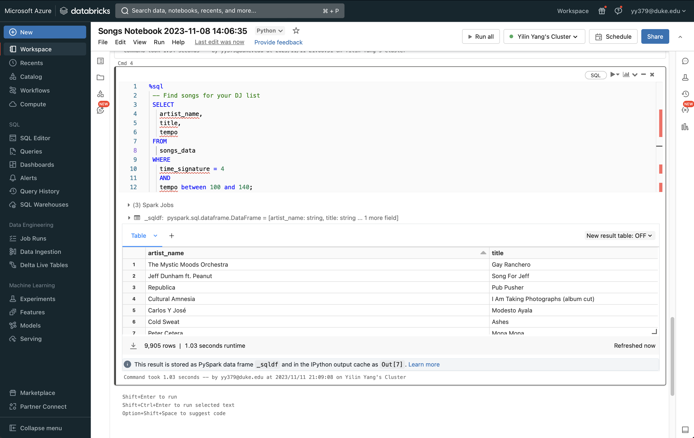
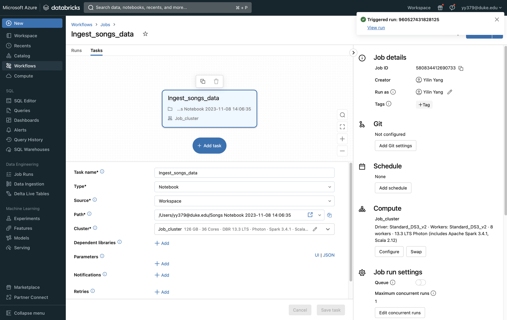
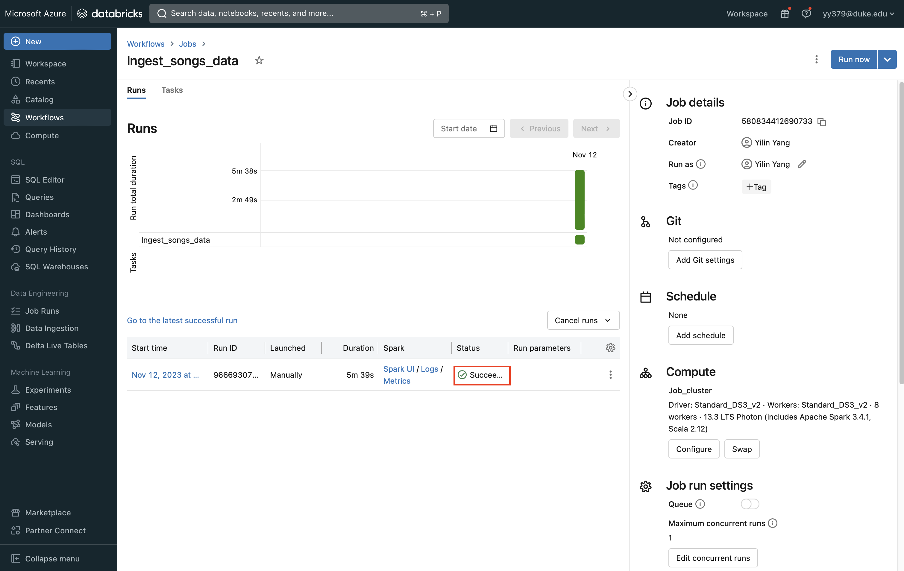

## Week 11: Data Pipeline with Databricks
- Goals :
1. Create a data pipeline using Databricks
2. Include at least one data source and one data sink

## Jupyter Notebook
- [Notebook for Databricks pipeline](https://github.com/nogibjj/Week11-Databricks/blob/main/Songs%20Notebook%202023-11-08%2014_06_35.ipynb)

## Steps
### Ingest the raw data

### Prepare the raw data

### Query the transformed data

> Which artists released the most songs each year?

> Find songs for your DJ list

### Create a Databricks job to run the pipeline

### Result

## Reference

1. https://github.com/nogibjj/python-template
2. https://docs.databricks.com/en/getting-started/data-pipeline-get-started.html